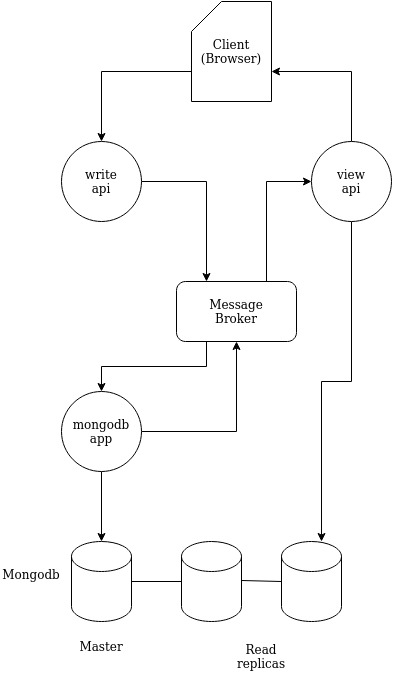

## About
- Web-app comments implementation using Spring boot, server sent events, rabbitmq message broker and mongodb 

## Service Architecture

The write-api is responsible for incoming requests with the intent to persist data into the database,
it will publish a message that rabbitmq will transmit and the mongodb-app will receive.

The mongodb-app is the application that will actually persist the data in mongodb, upon successful insertion it will send 
a message towards the view-api (via rabbitmq).

The view api is responsible for reading from the database and listening for insert events from mongodb-app

## Build & Run

### Docker

    Prerequisites: 
    Docker (https://www.docker.com/products/docker-desktop)

Navigate into the project directory and execute the docker-compose.yml (run in the background)
    
    docker compose up -d
The process will take several minutes (approx 2-5)   
When the process is complete you should be able to visit http://localhost:8080 and test the app

once you are done you can remove the images and volumes by running

    docker compose down --rmi all --volumes
to only remove the projects' (local) images (if you wish to remove the volumes as well add '--volumes')

    docker compose down --rmi local
to bring down the containers without removing the images

    docker compose down

### Java - Maven
    
    Prerequisites:
    Java 11 (https://jdk.java.net/java-se-ri/11)  
    Maven (https://maven.apache.org/download.cgi)

You can run each service as a jar file, 
for rabbitmq and mongodb you can run the modified compose yaml that only contains rabbitmq and mongodb

Navigate inside the project directory and execute the following 
    
    docker compose -f compose-rabbit-mongo.yml up -d
bring rabbitmq and mongodb services down by invoking

    docker compose -f compose-rabbit-mongo.yml down

due to an issue with the configuration files you will have to change the 'host' value of the configurations manually:  
inside /comments-app/comments/app/commons/src/resources/  
mongodb.yml  
&nbsp;&nbsp;&nbsp;&nbsp; change data.mongodb.host to 'localhost'
rabbitmq.yml  
change  spring.rabbitmq.host to 'localhost'

build the project with maven

    mvn clean install
run the jar files

    java -jar view-api/target/view-api-1.0-SNAPSHOT.jar
    java -jar  write-api/target/write-api-1.0-SNAPSHOT.jar
    java -jar mongodb-app/target/mongodb-app-1.0-SNAPSHOT.jar
